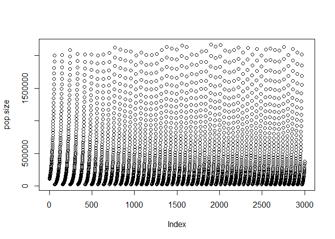

Ensure ABM is compiled, root dir is set to correct location of ALFA-K,
and the cpp_source is correctly set to the path of the ABM executable
file.

``` r
cpp_source <- "ABM/bin/ABM"
```

``` r
source("utils/sim_setup_functions.R")
source("utils/ALFA-K.R")
```

    ## Warning: package 'lhs' was built under R version 4.1.3

    ## Warning: package 'fields' was built under R version 4.1.3

    ## Loading required package: spam

    ## Warning: package 'spam' was built under R version 4.1.3

    ## Spam version 2.9-0 (2022-07-11) is loaded.
    ## Type 'help( Spam)' or 'demo( spam)' for a short introduction 
    ## and overview of this package.
    ## Help for individual functions is also obtained by adding the
    ## suffix '.spam' to the function name, e.g. 'help( chol.spam)'.

    ## 
    ## Attaching package: 'spam'

    ## The following objects are masked from 'package:base':
    ## 
    ##     backsolve, forwardsolve

    ## Loading required package: viridis

    ## Warning: package 'viridis' was built under R version 4.1.2

    ## Loading required package: viridisLite

    ## 
    ## Try help(fields) to get started.

``` r
dir.create("examples/example_1/sim_output")
```

Setup ABM simulation with random fitness landscape

The gen_replicate() function can be used to setup the directory
structure required to run an ABM simulation.

Arguments

Nchrom: number of chromosomes for each cell in simulation wavelength:
controls complexity of GRF fitness landscape. Lower wavelengths are more
complex. sweep_dir: output directory for sim cpp_source: path to ABM
executable p=0.00005: missegregation rate

Value

cpp_run_cmd: command necessesary to run ABM simulation sweep_id: name of
output folder that has been generated

The following chunk sets up and runs ABM simulation:

``` r
Nchrom <- 22
wavelength <- 0.8
misrate <- 0.00005
sweep_dir <- "examples/example_1/sim_output/"

info <-  gen_replicate(Nchrom=Nchrom,wavelength = wavelength,p = misrate,sweep_dir = sweep_dir,cpp_source = cpp_source)
system(info$cpp_run_cmd,show.output.on.console = F)
```

    ## [1] 0

The ABM simulation directory folder contains several files and folders.
The config file contains a lot of the information about the ABM sim. The
output_dir entry tells us where the sim output will be saved.

``` r
list.files(paste0(sweep_dir,info$sweep_id))
```

    ## [1] "config.txt"    "landscape.txt" "test"          "train"

``` r
config <-readLines(paste0(sweep_dir,info$sweep_id,"/config.txt"))
print(config)
```

    ##  [1] "init_kary,2,2,2,2,2,2,2,2,2,2,2,2,2,2,2,2,2,2,2,2,2,2"                                          
    ##  [2] "fitness_landscape_type,random"                                                                  
    ##  [3] "fitness_landscape_file,examples/example_1/sim_output//N_22_w_0p8_m_0.00005_rep_00/landscape.txt"
    ##  [4] "dt,0.1"                                                                                         
    ##  [5] "p,0.00005"                                                                                      
    ##  [6] "Nsteps,3000"                                                                                    
    ##  [7] "output_dir,examples/example_1/sim_output//N_22_w_0p8_m_0.00005_rep_00/train"                    
    ##  [8] "init_size,100000"                                                                               
    ##  [9] "scale,0.100658424208974"                                                                        
    ## [10] "wavelength,0.8"

``` r
output_dir <- unlist(strsplit(config[grepl("output_dir",config)],split=","))[2]
```

The output directory contains numbered subfolders corresponding to
repeated ABM runs with identical parameter sets. If we run the ABM
simulation again a new subfolder is created.

``` r
list.files(output_dir)
```

    ## [1] "00000"

``` r
system(info$cpp_run_cmd,show.output.on.console = F)
```

    ## [1] 0

``` r
list.files(output_dir)
```

    ## [1] "00000" "00001"

Each subfolder contains numbered csv files containing population samples
at indicated timepoints. There is also a summary file which contains
population size of the ABM at all timepoints simulated.

``` r
output_subdir <- paste(output_dir,list.files(output_dir)[1],sep="/")
head(list.files(output_subdir))
```

    ## [1] "00000.csv" "00074.csv" "00189.csv" "00302.csv" "00404.csv" "00491.csv"

``` r
pop.size <- readLines(paste0(output_subdir,"/summary.txt"))
plot(pop.size)
```



Process output from ABM simulation:

The proc_sim() function compiles output from the ABM simulation into a
format amenable to further analysis

Arguments

dir: directory containing csv output files from ABM simulation times:
numeric vector containing times to sample output from ABM simulation.
For each user-supplied time supplied, the closest timepoint among ABM
csv output files is selected.

Value

x: matrix with rows corresponding to karyotypes and columns
corresponding to timepoints. Values indicate the number of sampled
cells.

pop.fitness: growth rate of the sampled ABM population at each sampled
timepoint

dt: conversion factor between output timepoints and time in days. E.g.
if dt=0.1, timepoint 400 = 40 days.

clone.fitness: fitness of each karyotype in matrix x. values are ordered
according to rows of x.

``` r
x <- proc_sim("data/htert/train/00000/",times = seq(0,2800,400))
```

    ## Warning in proc_sim("data/htert/train/00000/", times = seq(0, 2800, 400)): NAs
    ## introduced by coercion

``` r
x <- proc_sim(dir=output_subdir,times = seq(0,2800,400))
```

    ## Warning in proc_sim(dir = output_subdir, times = seq(0, 2800, 400)): NAs
    ## introduced by coercion

``` r
print(head(x$x[order(rowSums(x$x),decreasing = T),]))
```

    ##                                                0 404 785 1170 1589 1974 2404
    ## 2.2.2.2.2.2.2.2.2.2.2.2.2.2.2.2.2.2.2.2.2.2 1038 520   0    0    0    0    0
    ## 2.2.2.2.2.3.3.3.3.1.1.2.3.1.4.2.2.4.2.4.2.4    0   0   0   16  355  582  331
    ## 2.2.2.2.1.3.3.3.3.1.1.2.3.1.4.2.2.4.2.4.2.4    0   0   0    1   75  269  390
    ## 2.2.2.2.2.3.3.3.3.1.1.2.3.2.3.3.1.3.3.3.1.3    0   4 319  386   71    1    0
    ## 2.2.2.2.2.2.2.2.2.2.2.2.2.2.3.3.1.3.4.4.2.4    0   2 180  361   83    1    0
    ## 2.2.3.1.1.1.2.2.2.2.2.2.2.3.1.3.3.1.1.3.3.3    0 206 247    3    1    0    0
    ##                                             2774
    ## 2.2.2.2.2.2.2.2.2.2.2.2.2.2.2.2.2.2.2.2.2.2    0
    ## 2.2.2.2.2.3.3.3.3.1.1.2.3.1.4.2.2.4.2.4.2.4  144
    ## 2.2.2.2.1.3.3.3.3.1.1.2.3.1.4.2.2.4.2.4.2.4  343
    ## 2.2.2.2.2.3.3.3.3.1.1.2.3.2.3.3.1.3.3.3.1.3    0
    ## 2.2.2.2.2.2.2.2.2.2.2.2.2.2.3.3.1.3.4.4.2.4    0
    ## 2.2.3.1.1.1.2.2.2.2.2.2.2.3.1.3.3.1.1.3.3.3    0

Estimate fitness landscape:

``` r
fit <- alfak(x,min_obs = 20)
```

    ## [1] 2
    ## [1] 3
    ## [1] 4
    ## [1] 5
    ## [1] 6
    ## [1] 7
    ## [1] 8
    ## [1] 9
    ## [1] 10
    ## [1] 11
    ## [1] 12
    ## [1] 13
    ## [1] 14
    ## [1] 15
    ## [1] 16
    ## [1] 17
    ## [1] 18
    ## [1] 19
    ## Warning: 
    ## Grid searches over lambda (nugget and sill variances) with  minima at the endpoints: 
    ##   (REML) Restricted maximum likelihood 
    ##    minimum at  right endpoint  lambda  =  0.03813737 (eff. df= 744.8 )

``` r
xmat <- do.call(rbind,lapply(rownames(fit$xo), function(i){
    as.numeric(unlist(strsplit(i,split="[.]")))
  }))
f_est <- predict(fit$fit,xmat)
```

Convert Krig to format readable by ABM and save:

``` r
knots <- fit$fit$knots
cc <- fit$fit$c
d <- fit$fit$d
fscape <- rbind(cbind(knots,cc),c(d))
fitted_landscape_path <- paste0(sweep_dir,info$sweep_id,"/fitted_landscape.txt")
write.table(fscape, fitted_landscape_path,row.names = FALSE,col.names=FALSE,sep=",")
```

Generate a new config file to use fitted landscape. Run ABM.

``` r
base_config <- readLines(paste0(sweep_dir,info$sweep_id,"/config.txt"))
new_config <- modify_config("fitness_landscape_type","krig",base_config)
new_config <- modify_config("fitness_landscape_file",fitted_landscape_path,new_config)

# we will save output from the fitted landscape in the test subfolder
test_dir <- paste0(sweep_dir,info$sweep_id,"/test") 
new_config <- modify_config("output_dir",test_dir,new_config)

new_config_path <- paste0(sweep_dir,info$sweep_id,"/fitted_landscape_config.txt") 
writeLines(new_config,new_config_path)
system(paste(cpp_source,new_config_path),show.output.on.console = F)
```

    ## [1] 0

Run ABM with custom karyotype composition

``` r
custom_pop_output <- paste0(sweep_dir,info$sweep_id,"/custom_pop")

dir.create(custom_pop_output)
k1 <- rep(2,22)
k2 <- rep(4,22)
pop <- rbind(k1,k2)

n_init <- c(50000,50000)
pop <- cbind(pop,n_init)

custom_pop_path <- paste0(sweep_dir,info$sweep_id,"/custom_pop.txt")
write.table(pop,custom_pop_path,sep=",",row.names = F,col.names = F)

config <- readLines(paste0(sweep_dir,info$sweep_id,"/config.txt"))
config <- c(config,paste0("population_file,",custom_pop_path))
config <- modify_config("output_dir",custom_pop_output,config)
custom_config_path <- paste0(sweep_dir,info$sweep_id,"/custom_pop_config.txt")
writeLines(config,custom_config_path)
system(paste(cpp_source,custom_config_path),show.output.on.console = F)
```

    ## [1] 0
